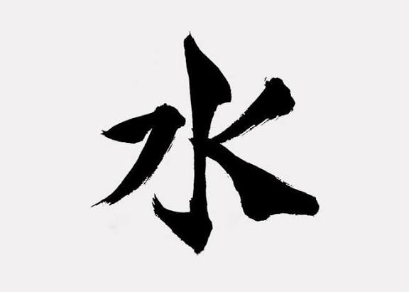

# Submission Proyek Klasifikasi Gambar kanji N5

Project ini berisi model klasifikasi gambar kanji N5 dalam format SavedModel, TFJS, dan TF-Lite. Aplikasi Streamlit tersedia di `app.py` untuk mencoba inferensi dari file gambar.

## Demo Aplikasi

Aplikasi dapat dicoba langsung melalui Streamlit Community Cloud:

[https://kanji-jlpt-n5.streamlit.app/](https://kanji-jlpt-n5.streamlit.app/)

## Contoh Gambar Uji

Berikut contoh gambar kanji yang dapat digunakan untuk mencoba aplikasi:



## Menjalankan Streamlit

1. Install dependency:

   ```bash
   pip install -r requirements.txt
   ```

2. Jalankan aplikasi:

   ```bash
   streamlit run app.py
   ```

3. Upload gambar kanji melalui browser yang terbuka.

Aplikasi menggunakan `tflite/model.tflite` dan `tflite/label.txt`. Preprocessing default mengikuti notebook: gambar diubah ke grayscale ukuran 64x64 dan warnanya diinversi sebelum diprediksi.
